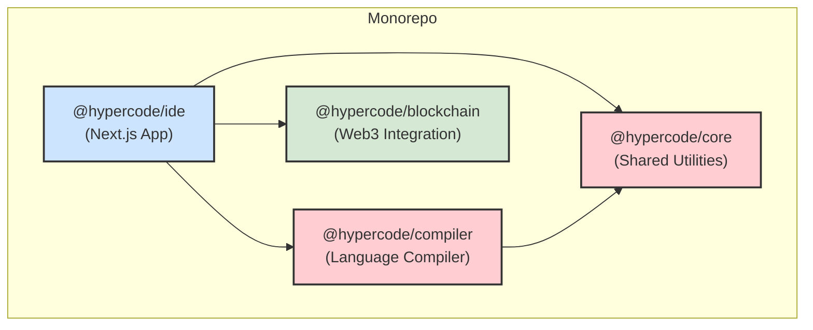

# HyperCode IDE Architecture

This document provides a detailed overview of the HyperCode IDE's technical architecture. Our goal is to maintain a clean, modular, and scalable codebase.

## 1. Monorepo with Yarn Workspaces & Turborepo

HyperCode is structured as a **monorepo** managed by [Yarn Workspaces](https://classic.yarnpkg.com/lang/en/docs/workspaces/) and [Turborepo](https://turborepo.org/). This approach allows us to manage multiple related packages within a single repository while maintaining fast, incremental builds and efficient task orchestration.

### Key Components

- **Yarn Workspaces**: Handles package linking and dependency management
- **Turborepo**: Optimizes build and test pipelines with intelligent caching
- **Git Submodules**: Used for `core` and `compiler` packages to enable independent versioning


All packages reside in the `packages/` directory. The root `package.json` file defines the workspace configuration and contains scripts for running tasks across all packages (e.g., `yarn build`, `yarn test`).

### Key Benefits

- **Single Install**: A single `yarn install` at the root installs dependencies for all packages.
- **Cross-Package Linking**: Packages can depend on each other directly using the `workspace:*` protocol. Yarn creates symlinks automatically, so changes in one package are immediately available to others.
- **Simplified Tooling**: Linters, compilers, and test runners can be configured once at the root level and applied across all packages.


## 2. Package Breakdown

Each package in the `packages/` directory has a distinct responsibility.

```
/packages/
├── ide/
├── core/
├── compiler/
└── blockchain/
```

### `packages/ide`

- **Description**: The main web application for the HyperCode IDE. This is what users interact with.
- **Tech Stack**: [Next.js](https://nextjs.org/) and [React](https://reactjs.org/).
- **Responsibilities**:
  - Renders the entire user interface (editor, sidebars, menus).
  - Manages application state.
  - Integrates with the `core`, `compiler`, and `blockchain` packages.
  - Handles user interactions and events.


### `packages/core`

- **Description**: A shared utility library. This package contains code that is used by multiple other packages in the monorepo.
- **Type**: **Git Submodule**.
- **Responsibilities**:
  - Defines shared TypeScript types and interfaces used across the project.
  - Provides common utility functions (e.g., string manipulation, data transformation).
  - Contains shared constants and configuration.


### `packages/compiler`

- **Description**: The compiler for the HyperCode programming language.
- **Type**: **Git Submodule**.
- **Responsibilities**:
  - **Lexer**: Transforms source code into a stream of tokens.
  - **Parser**: Builds an Abstract Syntax Tree (AST) from the token stream.
  - **Type Checker**: Performs static analysis to find type errors.
  - **Code Generation**: (Future) Compiles the AST to a target format (e.g., JavaScript, WebAssembly).


### `packages/blockchain`

- **Description**: The package for all Web3 and blockchain-related functionality.
- **Tech Stack**: [Hardhat](https://hardhat.org/) for Ethereum smart contract development.
- **Responsibilities**:
  - Contains the Solidity source code for smart contracts.
  - Includes scripts for deploying and interacting with contracts.
  - Provides a testing environment for smart contracts.
  - Exposes a defined interface for the `ide` package to interact with the blockchain.


## 3. Git Submodules

The `core` and `compiler` packages are managed as **Git submodules**. This means they are separate Git repositories that are tracked as specific commits within the main HyperCode IDE repository.

### Why Submodules

- **Independent Development**: The compiler and core logic can be developed and versioned independently of the IDE.
- **Reusability**: These components can be easily reused in other projects if needed.
- **Clear Separation**: Enforces a strong boundary between the IDE's frontend and the core language components.


### Working with Submodules

- **Cloning**: To clone the repository and initialize the submodules, use:

  ```bash
  git clone --recurse-submodules https://github.com/welshDog/HtperCode-IDE.git
  cd HtperCode-IDE
  ```

- **Updating Submodules**: To update all submodules to their latest committed state:

  ```bash
  git submodule update --init --recursive
  ```

- **Pulling Latest Changes**: To update submodules to their remote's latest commit:

  ```bash
  git submodule update --remote --merge
  ```


## 4. Development Workflow

### Local Development

1. Clone the repository with submodules
2. Install dependencies: `yarn install`
3. Start the development server: `yarn dev`
4. The IDE will be available at `http://localhost:3000`


### Building for Production

```bash
yarn build        # Build all packages
yarn workspace @hypercode/ide start  # Start production server
```


### Testing

```bash
yarn test         # Run tests across all packages
yarn test:watch   # Run tests in watch mode
yarn test:coverage # Generate test coverage reports
```


## 5. Workspace Dependency Graph

The packages depend on each other in a clear hierarchy, with no circular dependencies.



*Diagram created with Mermaid syntax.*

- The **IDE** is the primary consumer, depending on all other packages to function.
- The **Compiler** depends on **Core** for shared types and utilities.
- The **Blockchain** package is largely self-contained but is consumed by the IDE.
- The **Core** package has no dependencies on other packages in the monorepo, making it a foundational layer.